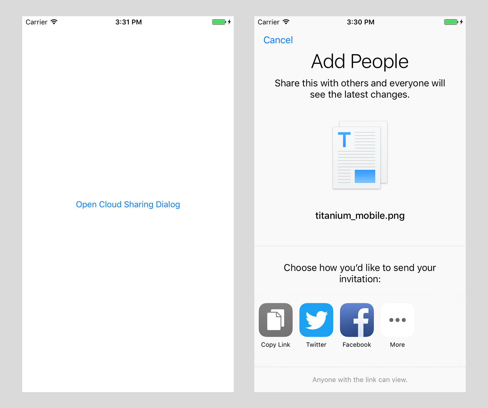

### CloudSharing Example
---
This example project demonstrates the usage of the new `UICloudSharingController` introduced in iOS 10. 
Please check out the [API diffs](https://developer.apple.com/library/prerelease/content/releasenotes/General/iOS10APIDiffs/Swift/UIKit.html) for more information on the new API's.
As for now, Apple does not document much around the API, so this example might be updated over the next months. 

### Contributing
---
If you have an improvement or issue, please let me know and open an [Issue](https://github.com/hansemannn/CloudSharingControllerExample/issues) or [Pull Request](https://github.com/hansemannn/CloudSharingControllerExample/pulls). Thanks! :rocket:

